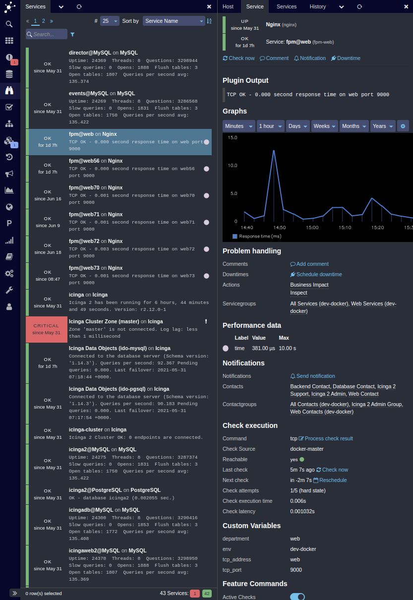

# Icinga Web 2

1. [About](#about)
2. [License](#license)
3. [Installation](#installation)
4. [Documentation](#documentation)
5. [Support](#support)
6. [Contributing](#contributing)

## About

**Icinga Web 2** is the next generation open source monitoring web interface, framework
and command-line interface developed by the [Icinga GmbH](https://icinga.com/), supporting Icinga 2,
Icinga DB Web and many more modules.

## License

Icinga Web 2 and the Icinga Web 2 documentation are licensed under the terms of the GNU
General Public License Version 3. You will find a copy of this license in [LICENSE.md](LICENSE.md)
included in the source package.

## Installation

For installing Icinga Web 2 please check the [installation chapter](https://icinga.com/docs/icingaweb2/latest/doc/02-Installation/)
in the documentation.

## Documentation

The documentation is located in the [doc/](doc/) directory and also available
on [icinga.com/docs](https://icinga.com/docs/icingaweb2/latest/).

## Support

Check the [project website](https://icinga.com) for status updates. Join the
[community channels](https://icinga.com/community/) for questions
or ask an Icinga partner for [professional support](https://icinga.com/support/).

## Contributing

There are many ways to contribute to Icinga -- whether it be sending patches,
testing, reporting bugs, or reviewing and updating the documentation. Every
contribution is appreciated!

Please continue reading in the [contributing chapter](CONTRIBUTING.md).

### Security Issues

For reporting security issues please visit [this page](https://icinga.com/contact/security/).
