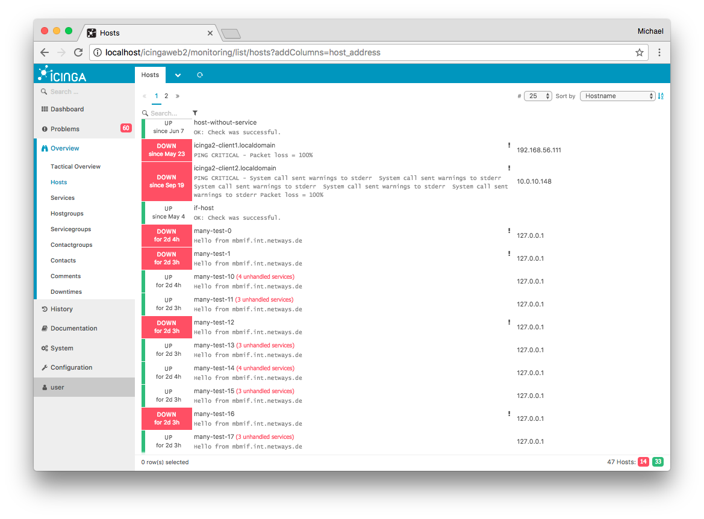
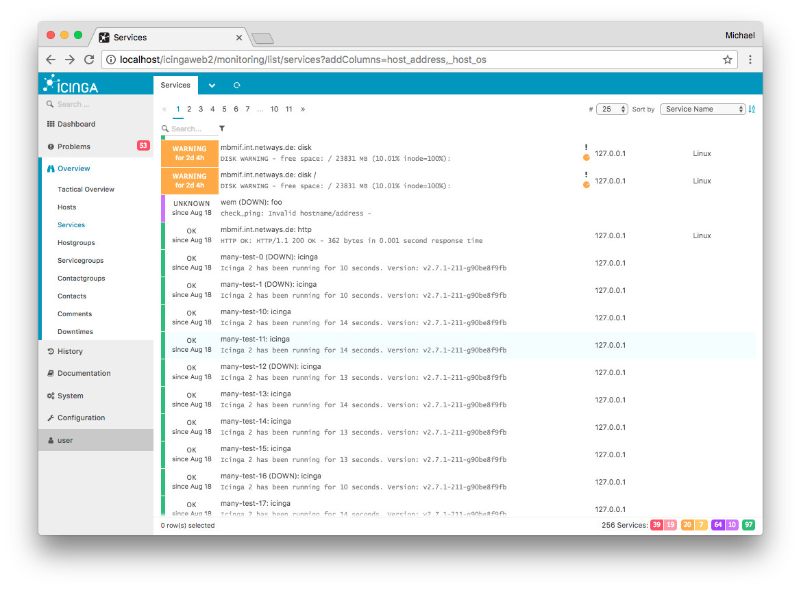

# Add Columns to List Views <a id="monitoring-module-add-columns-list-views"></a>

The monitoring module provides list views for hosts and services.
These lists only provide the most common columns to reduce the backend
query load.

If you want to add more columns to the list view e.g. in order to use the URL in
your dashboards or as external iframe integration, you need the `addColumns` URL
parameter.


Example for adding the host `address` attribute in a host list:

```
http://localhost/icingaweb2/monitoring/list/hosts?addColumns=host_address
```




Example for multiple columns as comma separated parameter string. This
includes a reference to the Icinga 2 host object custom attribute `os` using
`_host_` as custom variable identifier.

```
http://localhost/icingaweb2/monitoring/list/services?addColumns=host_address,_host_os
```


