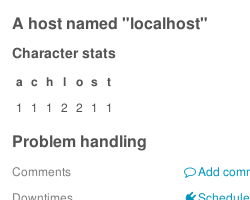

# Monitoring Module Hooks <a id="monitoring-module-hooks"></a>

## Detail View Extension Hook <a id="monitoring-module-hooks-detailviewextension"></a>

This hook can be used to easily extend the detail view of monitored objects (hosts and services).

### How it works <a id="monitoring-module-hooks-detailviewextension-how-it-works"></a>

#### Directory structure <a id="monitoring-module-hooks-detailviewextension-directory-structure"></a>

* `icingaweb2/modules/example`
    * `library/Example/ProvidedHook/Monitoring/DetailviewExtension/Simple.php`
    * `run.php`

#### Files <a id="monitoring-module-hooks-detailviewextension-files"></a>

##### run.php <a id="monitoring-module-hooks-detailviewextension-files-run-php"></a>

```php
<?php
/** @var \Icinga\Application\Modules\Module $this */

$this->provideHook(
    'monitoring/DetailviewExtension',
    'Icinga\Module\Example\ProvidedHook\Monitoring\DetailviewExtension\Simple'
);
```

##### Simple.php <a id="monitoring-module-hooks-detailviewextension-files-simple-php"></a>

```php
<?php
namespace Icinga\Module\Example\ProvidedHook\Monitoring\DetailviewExtension;

use Icinga\Module\Monitoring\Hook\DetailviewExtensionHook;
use Icinga\Module\Monitoring\Object\MonitoredObject;

class Simple extends DetailviewExtensionHook
{
    public function getHtmlForObject(MonitoredObject $object)
    {
        $stats = array();
        foreach (str_split($object->name) as $c) {
            if (isset($stats[$c])) {
                ++$stats[$c];
            } else {
                $stats[$c] = 1;
            }
        }

        ksort($stats);

        $view = $this->getView();

        $thead = '';
        $tbody = '';
        foreach ($stats as $c => $amount) {
            $thead .= '<th>' . $view->escape($c) . '</th>';
            $tbody .= '<td>' . $amount . '</td>';
        }

        return '<h2>'
            . $view->escape(sprintf($view->translate('A %s named "%s"'), $object->getType(), $object->name))
            . '</h2>'
            . '<h3>Character stats</h3>'
            . '<table>'
            . '<thead>' . $thead . '</thead>'
            . '<tbody>' . $tbody . '</tbody>'
            . '</table>';
    }
}
```

### How it looks <a id="monitoring-module-hooks-detailviewextension-how-it-looks"></a>


