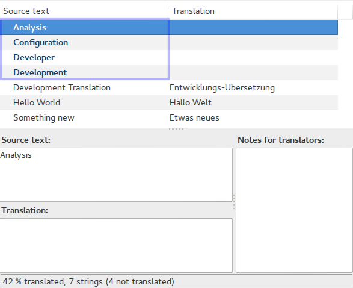

# Introduction <a id="module-translation-introduction"></a>

Icinga Web 2 provides localization out of the box - for itself and the core modules.
This module is for third party module developers to aid them to localize their work.

The chapters [Translation for Developers](03-Translation.md#module-translation-developers),
[Translation for Translators](03-Translation.md#module-translation-translators) and
[Testing Translations](03-Translation.md#module-translation-tests) will introduce and
explain you, how to take part on localizing modules to different languages.

## Translation for Developers <a id="module-translation-developers"></a>

To make use of the built-in translations in your module's code or views, you should use the method
`$this->translate('String to be translated')`, let's have a look at an example:

```php
<?php

class ExampleController extends Controller
{
    public function indexAction()
    {
        $this->view->title = $this->translate('Hello World');
    }
}
```

So if there a translation available for the `Hello World` string you will get an translated output, depends on the
language which is set in your configuration as the default language, if it is `de_DE` the output would be
`Hallo Welt`.

The same works also for views:

```
<h1><?= $this->title ?></h1>
<p>
    <?= $this->translate('Hello World') ?>
    <?= $this->translate('String to be translated') ?>
</p>
```

If you need to provide placeholders in your messages, you should wrap the `$this->translate()` with `sprintf()` for e.g.
    sprintf($this->translate('Hello User: (%s)'), $user->getName())

### Translating plural forms  <a id="module-translation-plural-forms"></a>

To provide a plural translation, just use the `translatePlural()` function.

```php
<?php

class ExampleController extends Controller
{
    public function indexAction()
    {
        $this->view->message = $this->translatePlural('Service', 'Services', 3);
    }
}
```

### Context based translation <a id="module-translation-context-based"></a>

If you want to provide context based translations, you can easily do it with an extra parameter in both methods
`translate()` and `translatePlural()`.

```php
<?php

class ExampleController extends Controller
{
    public function indexAction()
    {
        $this->view->title = $this->translate('My Title', 'mycontext');
        $this->view->message = $this->translatePlural('Service', 'Services', 3, 'mycontext');
    }
}
```

## Translation for Translators <a id="module-translation-translators"></a>

> **Note**:
>
> If you want to translate Icinga Web 2 or any module made by Icinga, please head over to
> [translate.icinga.com](https://translate.icinga.com) instead. We won't accept any contributions
> in this regard other than those made there.

Icinga Web 2 internally uses the UNIX standard gettext tool to perform internationalization, this means translation
files in the .po file format are supplied for text strings used in the code.

There are a lot of tools and techniques to work with .po localization files, you can choose what ever you prefer. We
won't let you alone on your first steps and therefore we'll introduce you a nice tool, called Poedit.

### Poedit <a id="module-translation-translators-poedit"></a>

First of all, you have to download and install [Poedit](http://poedit.net).
When you are done, you have to configure Poedit.

#### Configuration  <a id="module-translation-translators-poedit-configuration"></a>

`Personalize`: Please provide your Name and E-Mail under Identity.


`Editor`: Under the `Behavior` the Automatically compile .mo files on save, should be disabled.


`Translations Memory`: Under the `Database` please add your languages, for which are you writing translations.


When you are done, just save your new settings.

#### Editing .po files <a id="module-translation-translators-poedit-edit-po-files"></a>

> **Note**
>
> ll_CC stands for ll=language and CC=country code for e.g `de_DE`, `fr_FR`, `ru_RU`, `it_IT` etc.

To work with .po files, open or create the one for your language located under
`application/locale/ll_CC/LC_MESSAGES/yourmodule.po`. As shown below, you will
get then a full list of all available translation strings for the module. Each
module names its translation files `%module_name%.po`.


Now you can make changes and when there is no translation available, Poedit would mark it with a blue color, as shown
below.



And when you want to test your changes, please read more about under the chapter
[Testing Translations](Testing Translations).

## Testing Translations <a id="module-translation-tests"></a>

If you want to try out your translation changes in Icinga Web 2, you can make use of the CLI translations commands.

> **Note**:
>
> Please make sure that the gettext package is installed

To get an easier development with translations, you can activate the `translation module` which provides CLI commands,
after that you would be able to refresh and compile your .po files.

Let's assume, we want to provide German translations for our just new created module `yourmodule`.

If we haven't yet any translations strings in our .po file or even the .po file, we can use the CLI command, to do the
job for us:

```
icingacli translation refresh module yourmodule de_DE
```

This will go through all .php and .phtml files inside the module and a look after `$this->translate()` if there is
something to translate - if there is something and is not available in the `yourmodule.po` it will update this file
for us with new strings.

Now you can open the `application/locale/de_DE/LC_MESSAGES/yourmodule.po` and you will see something similar:

```
# Icinga Web 2 - Head for multiple monitoring backends.
# Copyright (C) 2014 Icinga Development Team
# This file is distributed under the same license as Development Module.
# FIRST AUTHOR <EMAIL@ADDRESS>, YEAR.
#
msgid ""
msgstr ""
"Project-Id-Version: Development Module (0.0.1)\n"
"Report-Msgid-Bugs-To: dev@icinga.com\n"
"POT-Creation-Date: 2014-09-09 10:12+0200\n"
"PO-Revision-Date: YEAR-MO-DA HO:MI+ZONE\n"
"Last-Translator: FULL NAME <EMAIL@ADDRESS>\n"
"Language: ll_CC\n"
"Language-Team: LANGUAGE <LL@li.org>\n"
"MIME-Version: 1.0\n"
"Content-Type: text/plain; charset=UTF-8\n"
"Content-Transfer-Encoding: 8bit\n"

#: /modules/yourmodule/configuration.php:6
msgid "yourmodule"
msgstr ""
```

Great, now you can adjust the file and provide the German `msgstr` for `yourmodule`.

```
#: /modules/yourmodule/configuration.php:6
msgid "Dummy"
msgstr "Attrappe"
```

The last step is to compile the `yourmodule.po` to the `yourmodule.mo`:

```
icingacli translation compile module yourmodule de_DE
```

> **Note**
>
> After compiling it you need to restart the web server to get new translations available in your module.

At this moment, everywhere in the module where the `Dummy` should be translated, it would return the translated
string `Attrappe`.
